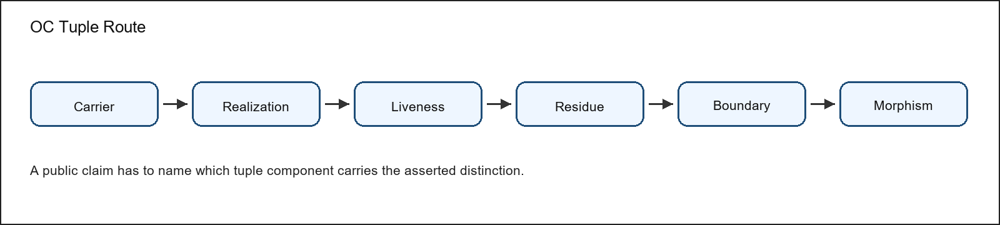
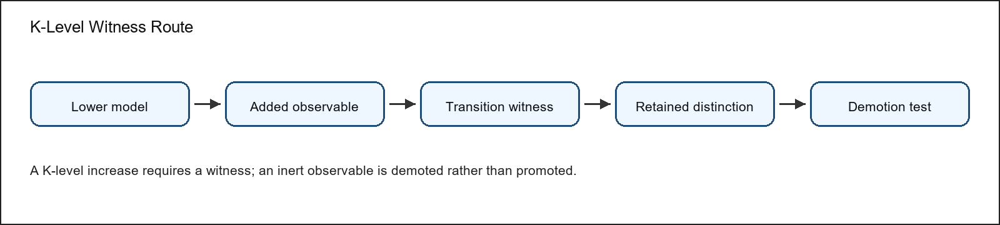

\begin{titlepage}
\thispagestyle{empty}
\centering
\vspace*{0.12\textheight}
{\Huge\bfseries OC Core Reviewer Attack and Response Map v1.3.3\par}
\vspace{1.2em}
{\Large Ontology of Continua Core release review artifact\par}
\vspace{2.5em}
{\large\textbf{Artifact role:} Adversarial objections, boundaries, and response map\par}
\vspace{2.5em}
{\large Alexander Yashin\par}
{\normalsize Independent Researcher\par}
{\normalsize ORCID 0009-0008-6166-0914\par}
\vfill
{\normalsize Version 1.3.3\par}
{\normalsize Release identity: oc\_core\_1\_3\_3\par}
{\normalsize Concept DOI: 10.5281/zenodo.17899134\par}
\vspace{1.5em}
{\small Citation identity: Alexander Yashin, OC Core Reviewer Attack and Response Map v1.3.3, version 1.3.3, 10.5281/zenodo.17899134.\par}
\vspace{1.2em}
{\small\itshape Dedicated to my dear wife Maria, without whom this work would have been impossible.\par}
\end{titlepage}
\clearpage

# Acknowledgements {.unnumbered}

The author thanks the reviewers and critics whose questions, objections, and suggestions contributed to the development of the Ontology of Continua and to the refinement of this release. The acknowledged contributors are G. V. Apostolov, Eduard Fadeev, Gennady Alekseevich Nosov, Sergey Shpadyrev, and Stanislav Tsukrov. Their criticism helped sharpen the claim boundaries, improve the reader route, expose weak presentation choices, and force clearer separation between model claims, proof routes, numerical evidence, prior-art comparison, and publication form. Acknowledgement records review pressure and intellectual contribution to the development of the work; it does not imply authorship, endorsement, publication approval, responsibility for the theory, or agreement with any claim promoted in the manuscript.

# Abstract {.unnumbered}

This reviewer map presents OC Core 1.3.3 as an adversarially inspectable claim surface. The Ontology of Continua is a typed model-core project for describing continuants, realizations, liveness, death, residue, boundaries, morphisms, operators, cycles, dimension, and K-level witnesses under explicit assumptions. Its immediate publication task is not to replace every domain science with a slogan. The task is to give reviewers a precise object whose definitions, proof routes, finite semantic checks, replay examples, comparator boundaries, and failure conditions can be inspected.

Version 1.3.3 is a bounded external-review release. It is mature enough to be read as a coherent scientific manuscript and to be checked against formal and executable artifacts, but it remains a staged research program rather than a declaration of final all-domain completion. The release promotes model-core claims where their assumptions and evidence are visible; it leaves broader numerical closure, wider domain validation, and stronger comparative claims as future obligations.

The package contains a full monograph, a compact article route, a methods and reproducibility companion, a reviewer attack-and-response map, release navigation, public evidence anchors, finite-model outputs, Lean subset evidence, bounded target-blind replay QA, comparator and prior-art material, and appendices for proof, figures, tables, numeric rows, and source trace. The monograph is the canonical reading spine; the other documents are curated routes for first reading, editorial review, replay, and hostile criticism.

The evidence status is deliberately mixed and explicit. Some claims are supported by theorem routes, proof sheets, Lean declarations, and finite semantic witnesses. Some claims are supported by bounded numerical or target-blind replay rows that should be read as scoped QA evidence, not as complete empirical validation of a whole domain. Some claims are positioned against prior art or retained as research boundaries because the available evidence is not yet strong enough for a broader statement.

The principal limitation is therefore part of the manuscript's method: public wording must not outrun the evidence. OC Core 1.3.3 asks the reader to evaluate whether the typed model, proof governance, finite semantics, numerical anchors, figures, tables, appendices, and reviewer-response routes form a coherent bounded model-core contribution. Future work must add evidence or mechanization before it widens the public claim surface.

# Version 1.3.3 Release Delta {.unnumbered}

Version 1.3.3 is the release in which the OC Core corpus is reorganized from a set of scattered source witnesses and process records into a reviewable scientific package. The visible delta is not merely a new archive number: the release strengthens the typed foundation, makes the claim boundary explicit, integrates the theorem route with public proof sheets, and separates reader-facing prose from machine evidence.

The model delta includes clearer treatment of carriers, realizations, liveness, death, residue, rebirth, morphisms, generalized boundaries, hybrid operators, cycle modes, historical and effective dimension, and K-level witnesses. These additions are presented as a bounded model-core grammar rather than as an unrestricted theory of every phenomenon.

The verification delta adds and consolidates a Lean-checked subset, structured proof sheets, finite semantic checks, finite witness interpretation, bounded target-blind replay QA, comparator and prior-art positioning, negative-control and falsifier language, and adversarial-review response material. Where a stronger claim is not yet earned, the release records the limitation instead of hiding it inside a source-control record.

The editorial delta is equally important. Figures, tables, formulas, numeric anchors, appendices, and evidence routes are kept in the publication corpus; machine coverage maps remain coverage and trace data only. The public documents are therefore built from the human manuscript hierarchy and curated payload sources, while source bindings and machine evidence indexes stay in the review manifest.

# Reader Contract {.unnumbered}

Dear reader, this manuscript is a public scientific reading surface for OC Core 1.3.3. It is not an internal routing memo, not a build log, and not a one-to-one printout of evidence-node records. The document exists so that a careful reader can understand the model before opening the machine-readable evidence package.

The work may be useful to several groups: scientists and philosophers testing the continuum model, formal-methods readers checking proof obligations, systems theorists comparing cross-domain structure, reproducibility reviewers replaying finite and numerical evidence, journal editors looking for a compact claim boundary, and hostile reviewers searching for overclaim, equivalence to prior art, or missing falsifiers.

Use the map by choosing the claim under attack, then reading the objection, response, evidence route, residual risk, and reopening condition. In the full package, the conceptual model and formulas live in the monograph's scientific body; the proof route and Lean subset live in theorem, proof, and formalization sections; numeric evidence and target-blind replay QA live in the methods/evidence route; figures and tables live in the monograph and its figure and evidence appendices; prior-art comparison and reviewer objections live in the article and attack-response map.

Read the limitations as part of the claim, not as a footnote. A statement is promoted only where its assumptions, proof or evidence class, comparator boundary, and reopening condition are visible. Claims about complete scientific coverage, unrestricted all-domain numerical closure, or unrestricted superiority over contemporary science are not promoted by this release.

\clearpage
\renewcommand*\contentsname{Table of Contents}
\setcounter{tocdepth}{2}
\setcounter{secnumdepth}{2}
\makeatletter
\renewcommand*\l@section{\@dottedtocline{1}{0em}{4.2em}}
\renewcommand*\l@subsection{\@dottedtocline{2}{1.8em}{5.2em}}
\makeatother
\tableofcontents
\clearpage

# Reading Map

This reading map is document-specific. The generated PDF table of contents gives page locations; the steps below state what the reader should do with each section.

1. Adversarial review method. Select the public claim or sentence under attack.
2. Claim families under attack. Identify the attack family and evidence class.
3. Proof and evidence responses. Ask what would make the claim fail.
4. Novelty and prior-art attacks. Inspect the proof, replay, comparator, or editorial evidence named for that family.
5. Residual risks. Apply the claim-specific reopening condition.
6. Reopening conditions. Record whether the repair is proof, data, wording, comparator, or publication-surface work.

# Adversarial Review Structure and Audience

Purpose and role. This document is written for hostile reviewers testing novelty, claim boundaries, proof support, and empirical scope. It exists to answer serious objections without exposing internal routing machinery as public prose, so the opening pages identify the intended reader before they introduce formal claims.

Construction and order. The argument is organized as objection, why it matters, response, evidence, residual risk, and reopening condition. The reviewer map is adversarial prose: each section begins with the objection, states the threatened claim, gives the answer, and names the residual risk.

The teaching obligation is that each challenge teaches what criticism would hit and how the release evidence answers or bounds it. The current research support is the bounded OC Core 1.3.3 model-core stack: typed model, theorem and proof route, Lean subset, finite semantic witnesses, bounded replay rows, comparator positioning, phenomenon coverage, negative controls, falsifiers, and adversarial review. For the reviewer map, the support stack is translated into objections, evidence-bound responses, residual risks, and reopening rules.

The document therefore states what the reader should learn from the evidence and where that evidence stops. It does not use release-readiness language as a substitute for scientific explanation, and it does not claim unsupported full-science completion.

# Reviewer Response Method

The reviewer map is organized by objections rather than by internal records. Each objection should be read as an attack on a claim boundary: what is being attacked, why the attack matters, what evidence answers it, what residual risk remains, and what future work would be required if the objection reopens.

Complete claim, theorem, finite-model, validation, and journal-package inventories remain in the evidence package. The public reviewer PDF summarizes only the adversarial path needed for a hostile reader to locate the answer.

# Claim Boundary and Research Limits

OC Core 1.3.3 is a bounded external-review scientific release. It contains a typed model foundation, theorem/proof evidence, a Lean-checked subset, finite-model semantics, bounded numeric replay QA rows, comparator positioning, and adversarial-review material.

The release does not claim complete scientific coverage, unrestricted numeric closure, or unrestricted comparative victory over contemporary science. Those statements are outside the promoted 1.3.3 public claim surface.

Journal owner-review packets are included as preparation material only. They help editors and reviewers see how a later submission could be assembled, but they are not part of the scientific proof of the model core.

# Adversarial Objection and Response Map

This map is organized for a hostile reader. Each group states the threatened claim, the criticism route, the response evidence, the residual risk, and the condition under which the objection would reopen. A row is not considered closed merely because an artifact exists.
The public text does not ask the reader to trust an internal status word. The response below is valid only when the cited proof, finite case, replay row, comparator row, or claim-boundary artifact supports the exact public claim.
To avoid turning the map into boilerplate, the reopening rules are stated as a method before the challenge list. A novelty response reopens if same-claim prior art absorbs the residual delta. A theorem response reopens if an assumption is missing, a proof dependency fails, or a finite witness no longer separates positive and negative cases. An empirical response reopens if a formula, pinned source, comparator, uncertainty, negative control, falsifier, or replay hash is absent or inconsistent. A phenomenon response reopens if the model card lacks a testable observable. An editorial response reopens if the public PDF becomes unreadable, fragmented, or dominated by registers again.

## Reviewer challenge 1: Theorem Proof Binding

A skeptical expert would press K0 resolution theorem, lifecycle status theorem, K-zero boundary theorem, boundary representation theorem, hybrid semantics theorem, and dimension semantics theorem at the point where assumptions do not license the promoted theorem, Lean theorem name is not build-certified, positive finite witness does not realize the theorem, negative control does not fail the stronger reading, and public claim omits theorem counterexample boundary. For reviewer challenge 1, the seriousness comes from the release's evidence discipline: the public sentence is defended only by the match between the visible wording, its assumptions, and the evidence that can actually carry that wording.
The response route is evidence-bound rather than status-bound. The relevant support is OC 1 3 3 K0 RESOLUTION FOUNDATION, proof sheet T133-K0-RES, Lean build certificate, and finite-model semantic report. The practical verification is proof-sheet assumptions and counterexample boundary for T133-K0-RES, Lean build certificate showing the cited declaration with successful build, paired finite-model positive and negative controls for K0 resolution theorem, and claim register boundary row T133-K0-RES. When that verification fails, the claim is not argued around; it is repaired, demoted, or held for a later research release.
Public locators. For reviewer challenge 1, use master monograph evidence chapters, public theorem and claim registers, proof sheet(s) T133-K0-RES, and T133-OMEGA-STATUS, and the reopening rule printed in this challenge. These locators are intentionally file-and-section level rather than status-token level, while the full path and checksum detail stays in the manifest and evidence package so the prose remains readable.
Residual risk is recorded as a reopening rule, not hidden in confidence language. For this challenge the repair path stays scientific: proof, finite semantics, replay evidence, comparator positioning, or public wording, depending on which cited support no longer carries the public sentence.

## Reviewer challenge 2: Theorem Public Surface Binding

This objection targets K0 resolution theorem, lifecycle status theorem, K-zero boundary theorem, boundary representation theorem, hybrid semantics theorem, and dimension semantics theorem at the point where hostile reader cannot trace the theorem from tuple to finite falsifier, the theorem has no explicit falsifier/counterexample boundary, the theorem dependency chain is not declared, and the public claim surface could exceed the formal theorem. For reviewer challenge 2, the seriousness comes from the release's evidence discipline: the public sentence is defended only by the match between the visible wording, its assumptions, and the evidence that can actually carry that wording.
The answer is local to the cited support. The relevant support is OC 1 3 3 HOSTILE READER GUIDE, claim register boundary, and proof sheet T133-K0-RES. The practical verification is OC 1 3 3 HOSTILE READER GUIDE, proof-sheet assumptions and counterexample boundary for T133-K0-RES, Lean build certificate showing T133-K0-RES with successful build, and claim register boundary row T133-K0-RES. When that verification fails, the claim is not argued around; it is repaired, demoted, or held for a later research release.
Review path. For reviewer challenge 2, use master monograph evidence chapters, public theorem and claim registers, proof sheet(s) T133-K0-RES, and T133-OMEGA-STATUS, and the reopening rule printed in this challenge. These locators are intentionally file-and-section level rather than status-token level, while the full path and checksum detail stays in the manifest and evidence package so the prose remains readable.
Residual risk is recorded as a reopening rule, not hidden in confidence language. For this challenge the repair path stays scientific: proof, finite semantics, replay evidence, comparator positioning, or public wording, depending on which cited support no longer carries the public sentence.

## Reviewer challenge 3: Minimality Component Witness

The hostile reading begins with minimality witness theorem at the point where carrier could be removed without verdict loss, realization could be removed without verdict loss, lawful_possibility could be removed without verdict loss, liveness could be removed without verdict loss, and residue could be removed without verdict loss. For reviewer challenge 3, the seriousness comes from the release's evidence discipline: the public sentence is defended only by the match between the visible wording, its assumptions, and the evidence that can actually carry that wording.
The release answers by binding the sentence to public artifacts. The relevant support is OC133 GLOBAL MINIMALITY WITNESSES, finite-model semantic report, and Lean build certificate. The practical verification is FM-MIN-carrier observed keep verdict=PASS and observed drop verdict=FAIL, FM-MIN-realization observed keep verdict=PASS and observed drop verdict=FAIL, FM-MIN-lawful possibility observed keep verdict=PASS and observed drop verdict=FAIL, FM-MIN-liveness observed keep verdict=PASS and observed drop verdict=FAIL, and FM-MIN-residue observed keep verdict=PASS and observed drop verdict=FAIL. When that verification fails, the claim is not argued around; it is repaired, demoted, or held for a later research release.
Where to verify. For reviewer challenge 3, use master monograph evidence chapters, public theorem and claim registers, and the reopening rule printed in this challenge. These locators are intentionally file-and-section level rather than status-token level, while the full path and checksum detail stays in the manifest and evidence package so the prose remains readable.
Residual risk is recorded as a reopening rule, not hidden in confidence language. For this challenge the repair path stays scientific: proof, finite semantics, replay evidence, comparator positioning, or public wording, depending on which cited support no longer carries the public sentence.

## Reviewer challenge 4: Klevel Transition Witness

A journal reviewer could attack K-level witness theorem at the point where adjacent transition has no retained-witness reduction failure and lawful demotion pair. For reviewer challenge 4, the seriousness comes from the release's evidence discipline: the public sentence is defended only by the match between the visible wording, its assumptions, and the evidence that can actually carry that wording.
The repairable claim boundary is the center of the response. The relevant support is k level irreducibility matrix, finite-model semantic report, and Lean build certificate. The practical verification is FM-KLEVEL-K0 to K1=FAILS WITH WITNESS and FM-KLEVEL-K0 to K1-NEG=DEMOTABLE WITH LOST WITNESS, FM-KLEVEL-K1 to K2=FAILS WITH WITNESS and FM-KLEVEL-K1 to K2-NEG=DEMOTABLE WITH LOST WITNESS, FM-KLEVEL-K2 to K3=FAILS WITH WITNESS and FM-KLEVEL-K2 to K3-NEG=DEMOTABLE WITH LOST WITNESS, FM-KLEVEL-K3 to K4=FAILS WITH WITNESS and FM-KLEVEL-K3 to K4-NEG=DEMOTABLE WITH LOST WITNESS, and FM-KLEVEL-K4 to K5=FAILS WITH WITNESS and FM-KLEVEL-K4 to K5-NEG=DEMOTABLE WITH LOST WITNESS. When that verification fails, the claim is not argued around; it is repaired, demoted, or held for a later research release.
Audit route. For reviewer challenge 4, use master monograph evidence chapters, public theorem and claim registers, and the reopening rule printed in this challenge. These locators are intentionally file-and-section level rather than status-token level, while the full path and checksum detail stays in the manifest and evidence package so the prose remains readable.
Residual risk is recorded as a reopening rule, not hidden in confidence language. For this challenge the repair path stays scientific: proof, finite semantics, replay evidence, comparator positioning, or public wording, depending on which cited support no longer carries the public sentence.

## Reviewer challenge 5: Numeric Replay Quarantine

The strongest version of the criticism is aimed at OC133-NUM-PHYS-C, OC133-NUM-CHEM-WEBBOOK-H2O, OC133-NUM-CHEM-H2O, OC133-NUM-BIO-GEO-COUNT, OC133-NUM-SYS-WDI-GDP, and OC133-NUM-MATH-FINITE at the point where numeric replay could be promoted as empirical/prediction support. For reviewer challenge 5, the seriousness comes from the release's evidence discipline: the public sentence is defended only by the match between the visible wording, its assumptions, and the evidence that can actually carry that wording.
The evidence route is deliberately narrower than the ambition it organizes. The relevant support is bounded replay evidence table OC133 NUMERIC REPLAY QA TABLE, and bounded replay evidence table OC133 NUMERIC REPLAY LOG. The practical verification is bounded numeric replay rows with comparator, residual, negative-control, falsifier, and replay hash. When that verification fails, the claim is not argued around; it is repaired, demoted, or held for a later research release.
Evidence entry points. For reviewer challenge 5, use master monograph evidence chapters, public theorem and claim registers, and the reopening rule printed in this challenge. These locators are intentionally file-and-section level rather than status-token level, while the full path and checksum detail stays in the manifest and evidence package so the prose remains readable.
Residual risk is recorded as a reopening rule, not hidden in confidence language. For this challenge the repair path stays scientific: proof, finite semantics, replay evidence, comparator positioning, or public wording, depending on which cited support no longer carries the public sentence.

## Reviewer challenge 6: Phenomenon Coverage Model Card

The editorially relevant attack concerns K0 resolution theorem, lifecycle status theorem, cycle-mode theorem, boundary representation theorem, hybrid semantics theorem, and dimension semantics theorem at the point where phenomenon row lacks formal instance, observable, replay, negative control, or falsifier. For reviewer challenge 6, the seriousness comes from the release's evidence discipline: the public sentence is defended only by the match between the visible wording, its assumptions, and the evidence that can actually carry that wording.
The public answer is acceptable only because it remains testable. The relevant support is Lean build certificate, finite-model semantic report, proof sheet T133-K0-RES, and proof sheet T133-OMEGA-STATUS. The practical verification is paired finite-model positive and negative controls for K0 resolution theorem, paired finite-model positive and negative controls for lifecycle status theorem, paired finite-model positive and negative controls for cycle-mode theorem, paired finite-model positive and negative controls for boundary representation theorem, and paired finite-model positive and negative controls for hybrid semantics theorem. When that verification fails, the claim is not argued around; it is repaired, demoted, or held for a later research release.
Reader navigation. For reviewer challenge 6, use master monograph evidence chapters, public theorem and claim registers, proof sheet(s) T133-BOUNDARY, T133-CYCLE, T133-DIM, and T133-HYBRID, and the reopening rule printed in this challenge. These locators are intentionally file-and-section level rather than status-token level, while the full path and checksum detail stays in the manifest and evidence package so the prose remains readable.
Residual risk is recorded as a reopening rule, not hidden in confidence language. For this challenge the repair path stays scientific: proof, finite semantics, replay evidence, comparator positioning, or public wording, depending on which cited support no longer carries the public sentence.

## Reviewer challenge 7: Prior Art Positioning

A skeptical expert would press OC133-NOVELTY-001 at the point where accepted overlap with general systems framing and cross-domain system concepts could be mistaken for OC uniqueness, accepted overlap with autopoietic organization of living systems could be mistaken for OC uniqueness, accepted overlap with mathematical dynamical-system state evolution could be mistaken for OC uniqueness, accepted overlap with category/topos formalisms and internal logic could be mistaken for OC uniqueness, and accepted overlap with RAF formalization of autocatalytic sets and boundary discussion could be mistaken for OC uniqueness. For reviewer challenge 7, the seriousness comes from the release's evidence discipline: the public sentence is defended only by the match between the visible wording, its assumptions, and the evidence that can actually carry that wording.
The response route is evidence-bound rather than status-bound. The relevant support is prior-art comparator evidence table SRC-01-01, prior-art comparator evidence table SRC-02-01, prior-art comparator evidence table SRC-03-01, prior-art comparator evidence table SRC-04-01, prior-art comparator evidence table SRC-05-01, and prior-art comparator evidence table SRC-06-01. The practical verification is prior-art comparator evidence table General System Theory uniqueness claim status=positioning only; no priority claim; priority date status=positioning only; no priority assertion, prior-art comparator evidence table Autopoiesis uniqueness claim status=positioning only; no priority claim; priority date status=positioning only; no priority assertion, prior-art comparator evidence table Dynamical Systems uniqueness claim status=positioning only; no priority claim; priority date status=positioning only; no priority assertion, prior-art comparator evidence table Category and Topos Formalisms uniqueness claim status=positioning only; no priority claim; priority date status=positioning only; no priority assertion, and prior-art comparator evidence table RAF Theory uniqueness claim status=positioning only; no priority claim; priority date status=positioning only; no priority assertion. When that verification fails, the claim is not argued around; it is repaired, demoted, or held for a later research release.
Public locators. For reviewer challenge 7, use master monograph evidence chapters, public theorem and claim registers, and the reopening rule printed in this challenge. These locators are intentionally file-and-section level rather than status-token level, while the full path and checksum detail stays in the manifest and evidence package so the prose remains readable.
Residual risk is recorded as a reopening rule, not hidden in confidence language. For this challenge the repair path stays scientific: proof, finite semantics, replay evidence, comparator positioning, or public wording, depending on which cited support no longer carries the public sentence.

## Reviewer challenge 8: Attack Matrix Distinct Surface Coverage

This objection targets K0 resolution theorem, lifecycle status theorem, K-zero boundary theorem, boundary representation theorem, and hybrid semantics theorem at the point where K0 resolution-relative distinguishability theorem: assumptions could drift from the proof/evaluator boundary, K0 resolution-relative distinguishability theorem: negative control could be absent or non-responsive, K0 resolution-relative distinguishability theorem: public wording could exceed the machine-checked claim, K0 resolution-relative distinguishability theorem: falsifier could be missing, vague, or non-executable, and K0 resolution-relative distinguishability theorem: dependency refs could omit the load-bearing artifact. For reviewer challenge 8, the seriousness comes from the release's evidence discipline: the public sentence is defended only by the match between the visible wording, its assumptions, and the evidence that can actually carry that wording.
The answer is local to the cited support. The relevant support is OC 1 3 3 K0 RESOLUTION FOUNDATION, proof sheet T133-K0-RES, claim register boundary, THEOREM REGISTRY 1 3 3, the theorem inventory, and paired finite-model positive and negative controls for K0 resolution theorem. The practical verification is paired finite-model positive and negative controls for K0 resolution theorem. When that verification fails, the claim is not argued around; it is repaired, demoted, or held for a later research release.
Review path. For reviewer challenge 8, use master monograph evidence chapters, public theorem and claim registers, proof sheet(s) T133-K0-RES, finite case family FM-T133-K0-RES-NEG, and FM-T133-K0-RES-POS, and the reopening rule printed in this challenge. These locators are intentionally file-and-section level rather than status-token level, while the full path and checksum detail stays in the manifest and evidence package so the prose remains readable.
Residual risk is recorded as a reopening rule, not hidden in confidence language. For this challenge the repair path stays scientific: proof, finite semantics, replay evidence, comparator positioning, or public wording, depending on which cited support no longer carries the public sentence.

# Adversarial Review Method

The reviewer map is written for an unsympathetic reader. Its purpose is not to persuade by accumulation of files; its purpose is to identify where the release could fail. Every serious attack is read as a relation between a public sentence, the claim it threatens, the evidence offered for that claim, and the exact condition under which the sentence would have to be repaired.

The map therefore uses a narrow standard for closure. A criticism is not closed because a document exists. It is closed only when the public wording is no stronger than the proof, finite witness, replay row, comparator row, or claim-boundary artifact that carries it. If the support is local, the response is local. If the evidence is only a bounded replay row, the public sentence must not sound like a whole-field law.

## Attack Family 1: The Theory Is Only a Reframing

The strongest novelty attack says that OC merely relabels existing systems theory, dynamical systems, autopoiesis, category-oriented formalism, RAF closure, identity theory, or reproducibility practice. The response begins by accepting overlap. OC cannot defend itself by pretending those traditions do not exist. The defensible question is narrower: does the released object bind a typed continuum model, proof governance, finite semantic witnesses, bounded replay rows, prior-art comparison, and public claim boundaries into one auditable model-core package?

The residual-delta answer remains bounded. If a comparator already supplies the same claim under the same assumptions and with the same evidence discipline, OC cannot promote priority. If OC supplies a different integration of typed status, K-level witnesses, lifecycle boundaries, and reviewable evidence surfaces, the residual claim can remain. The reviewer map keeps this distinction visible because novelty is not a mood; it is a same-claim comparison.

## Attack Family 2: The Formal Claims Are Theatre

A theorem label can be decorative unless it is tied to assumptions, definitions, dependencies, proof idea, mechanized subset where available, finite witness where relevant, and counterexample boundary. The reviewer should attack theorem labels by asking which assumption does the work and what breaks if that assumption is removed. A proof sheet that cannot answer that question is not allowed to carry a promoted theorem claim.

For 1.3.3, the bounded response is that theorem claims are routed through proof sheets, selected Lean declarations, and finite semantic witnesses where applicable. The route does not imply that every mathematical sentence in the monograph has been fully mechanized. It means that the promoted theorem surface is no longer allowed to float without an evidence class. If a theorem sentence grows beyond its supporting class, the public wording must shrink or the proof surface must improve.

## Attack Family 3: The Empirical Rows Are Too Weak

An empirical reviewer should not accept a number merely because it appears in a release archive. The attack asks whether each row contains the right fields: source identity, reconstruction rule or formula, split or target policy where applicable, predicted or reconstructed value, observed value, uncertainty or residual, comparator, negative control, falsifier, and replay hash. Missing fields reopen the row.

The response is deliberately modest. The release uses bounded replay and reconstruction rows to show operationalization and artifact-integrity discipline. It does not ask those rows to prove complete domain coverage. This is not a retreat from ambition; it is how ambition becomes testable. A future stronger empirical claim would need a stronger protocol, not louder wording.

## Attack Family 4: Phenomenon Coverage Is Inflated

A broad model can list phenomena faster than it explains them. The reviewer should therefore ask whether each named phenomenon has an OC instance, observable, explanation or replay path, comparator, negative control, falsifier, and claim boundary. Naming a phenomenon is not enough. A model card that lacks an observable or falsifier stays outside promoted explanation.

The release response is to keep phenomenon coverage scoped. Phenomena with complete cards can be used as bounded review examples. Phenomena that are illustrative, protocol-ready, or not yet evidenced stay in the monograph as context or future work but do not become promoted public claims. This distinction protects the reader from mistaking coverage vocabulary for evidence.

## Attack Family 5: Public Wording Outruns Evidence

The claim-boundary attack is often the most important one. A theory can have useful definitions and still fail as a publication if public language implies more than the artifact layer supports. The reviewer should scan for totality, finality, unrestricted numeric closure, unrestricted comparison, and implied endorsement. If such language appears without literal evidence, it is a release defect.

The repaired 1.3.3 public surface uses bounded wording. It promotes a model-core package with proof, finite, replay, comparator, and review evidence. It excludes complete scientific coverage and unrestricted comparison from the promoted surface. That exclusion is not a hidden caveat; it is a scientific boundary statement that tells the reader exactly what the release is and is not claiming.

## Attack Family 6: The Package Is Not a Scientific Text

A scientific release can fail even when its checksums are correct. If the first public experience is a metadata dump, an internal routing memo, a raw register, or a collection of appended deltas, the release is not publication-grade. The reviewer should inspect the title page, dedication, abstract, table of contents, didactic order, page flow, figure use, literature discussion, and conclusion before trusting the archive.

The corrected map treats editorial quality as part of scientific quality. The monograph carries the long argument. The journal core carries the article path. The methods companion explains replay. The reviewer map explains attacks. The archive carries evidence. If those roles blur again, the release reopens because the reader cannot know which artifact carries which burden.

# Reopening Rules

A novelty response reopens if same-claim prior art absorbs the residual delta. A theorem response reopens if an assumption is missing, a proof dependency fails, or a finite witness no longer separates positive and negative cases. An empirical response reopens if a formula, pinned source, comparator, uncertainty, negative control, falsifier, or replay hash is absent or inconsistent. A phenomenon response reopens if the model card lacks a testable observable. An editorial response reopens if the public PDF becomes unreadable, fragmented, or dominated by registers again.

These reopening rules make the reviewer map useful after publication as well as before publication. They tell future maintainers how to classify a defect without arguing from scratch. A defect should become a known-error pattern and a gate for later releases, not a one-time apology.

# What a Hostile Reader Should Do

A hostile reader should first choose the public sentence under attack, then identify the claim family, then inspect the evidence class, then ask whether the support is strong enough for the wording. If the sentence is formal, inspect proof assumptions and mechanized or finite witnesses. If it is empirical, inspect the replay row. If it is comparative, inspect the comparator row. If it is editorial, inspect the rendered PDF and public archive page.

The release is designed to survive that process by being bounded, not evasive. It should be possible to disagree with OC Core 1.3.3 scientifically without discovering a hidden mismatch between files, claims, and evidence. When such a mismatch is found, the correct answer is repair, not defensiveness.

# Reviewer Role Playbook

The attack map becomes useful only when different reviewers can use it without sharing private context. This playbook therefore rewrites the same release object through the eyes of several hostile readers. Each role names what it should attack first, what would count as a serious answer, and what would reopen the issue.

## Formal-Mathematics Reviewer

The formal reviewer should begin by refusing to accept theorem labels as proof. The first question is whether each promoted theorem has a typed statement, assumptions, definitions, dependencies, proof idea, and counterexample boundary. The second question is whether the Lean subset and finite semantic witnesses are cited at the right strength. A Lean declaration can support a selected formal pattern, but it does not certify every surrounding informal paragraph.

A serious answer for this reviewer names the exact theorem identifier, the proof sheet, the dependency path, and the witness or mechanized declaration if one is claimed. A weak answer points to the monograph as a whole. A failing answer changes the wording of a theorem claim without changing its evidence. The issue reopens when an assumption is implicit, when a theorem ID is orphaned, when a proof sheet gives only a slogan, or when a finite witness is label-driven rather than fact-driven.

## Computational-Semantics Reviewer

The computational reviewer should attack the finite-model layer as if every verdict were self-confirming until proven otherwise. The question is whether inputs contain raw model facts and whether the runner computes outcomes independently from expected labels. Mutation controls matter because they show whether the evaluator rejects tampered, inert, or wrong-witness cases.

A serious answer cites the finite-model report, the case family, the positive witness, and the paired negative control. A weak answer says that all cases pass. A failing answer is one in which changing a label changes the outcome or changing the model facts fails to change the outcome where the theorem says it should. The issue reopens when evidence rows contain conclusion booleans, when controls are absent, or when a public theorem cites a case whose semantics do not carry the claimed distinction.

## Empirical-Statistics Reviewer

The empirical reviewer should treat every numeric row as suspect until the reconstruction path is complete. The row needs a source identity, pinned snapshot or official source record, formula, target policy, predicted or reconstructed value, observed value, uncertainty or residual, comparator baseline, negative control, falsifier, and replay hash. A row without a comparator cannot support comparative wording. A row without a negative control cannot support empirical promotion.

A serious answer for this reviewer is local: it says exactly what the row supports and exactly what it does not support. A weak answer cites the authority of a data source without showing the replay. A failing answer uses a successful reconstruction as if it proved a whole domain. The issue reopens when a row becomes circular, when a target was not held out where the claim needs it, when residuals are not interpreted, or when public prose upgrades a bounded replay into a domain law.

## Prior-Art Historian

The prior-art reviewer should assume overlap until the manuscript proves a residual difference. This reviewer asks whether OC credits systems theory, autopoiesis, dynamical systems, hybrid systems, category and type-theoretic formalisms, RAF closure, complexity measures, identity theory, systems engineering, and reproducible-research practice. The comparison must be same-claim comparison, not a generic bibliography.

A serious answer states what is inherited, what is reorganized, what residual delta remains, and which public claim that residual delta can support. A weak answer lists sources without using them. A failing answer claims novelty from absence of a source in a short sample. The issue reopens when a comparator row lacks overlap fields, when residual delta is vague, when a stronger priority sentence appears, or when public metadata presents the release as if it had no predecessors.

## Journal Editor

The journal editor should first ask whether the package reads as a scientific manuscript set rather than as a repository export. The editor checks title pages, dedication, abstract, table of contents, argument order, section transitions, literature synthesis, figure placement, conclusion, data availability, conflict/funding statement, AI assistance disclosure, and the distinction between public release and journal article preparation.

A serious answer is visible before opening machine-readable files. The editor sees a monograph, a compact article, a methods companion, a reviewer map, and a curated evidence package with distinct roles. A weak answer requires the editor to infer roles from filenames. A failing answer lets metadata, checksums, internal statuses, or appended deltas become the primary public reading surface. The issue reopens when any public PDF lacks frontmatter, when page flow is broken, or when a public record previews metadata instead of the scientific landing document.

## Hostile Generalist

The hostile generalist should attack intelligibility. The question is not only whether the model is formal; it is whether a technically literate reader can understand why the formalism exists. This reviewer asks what problem is being solved, why the object is typed, how liveness differs from ordinary persistence, why residue is separated from identity, how K-level claims become testable, and what kind of evidence would make the model fail.

A serious answer gives a didactic path from tuple to theorem to example to falsifier. A weak answer says that the full monograph contains everything somewhere. A failing answer forces the reader to reconstruct the theory from registers. The issue reopens when terms are introduced without motivation, when diagrams are absent or misplaced, when examples do not connect to claims, or when a public claim cannot be explained without private process history.

## Publication-Metadata Reviewer

A serious answer keeps public metadata professional and concise. Zenodo needs a rendered abstract and reading order, not raw Markdown or a checksum-only display. GitHub can carry a longer Markdown release body, but it still has to match the DOI, asset set, and claim boundary. The issue reopens when version strings diverge, when stale assets remain, when a DOI points to an inferior file set, when inherited Zenodo files are not cleared, or when journal packages are described as submitted before a separate submission action exists.

## Release-Engineering Reviewer

The release-engineering reviewer attacks the process rather than the theory. The question is whether a verification step can dirty the release, whether a semantic delta triggers only the necessary downstream work, and whether absence of a meaningful delta stops the chain. This reviewer also checks whether a known publication error has become a permanent regression test.

A serious answer uses delta-stable verification and known-error management. A weak answer reruns everything repeatedly without explaining why. A failing answer lets a read-only check rewrite tracked artifacts or lets a public release proceed because file names look correct while text quality is poor. The issue reopens when verification creates ungoverned dirt, when a generated artifact changes without input delta, or when an already-seen defect class appears again.

## Synthesis Reviewer

The synthesis reviewer asks whether the release is more than a pile of correct parts. The model, proof route, finite semantics, replay rows, comparator register, reviewer map, publication metadata, and journal packages must tell the same story. A contradiction between any two layers is a scientific defect because it makes the public claim ambiguous.

A serious answer shows role separation and traceability. The monograph teaches the theory, the journal core compresses it, the methods companion explains replay, the reviewer map attacks it, the public zip carries evidence, and metadata makes the archive citable. A weak answer is a set of green gates. A failing answer is a release in which every component exists but the reader cannot tell how they fit together. The issue reopens when component roles blur, when a claim is promoted in one file and bounded in another, or when external positioning diverges from evidence.

## Claim-Repair Decision Ladder

When an attack succeeds, the repair is not always to add more text. The first decision is whether the claim is true under the current evidence class. If the claim is too strong, the correct repair is demotion or boundary clarification. If the claim is right but the evidence is hidden, the correct repair is traceability. If the evidence is insufficient but the claim is important, the correct repair is new proof, new finite semantics, new replay protocol, or new comparator work.

This decision ladder prevents two opposite failures. It prevents cosmetic narrowing, where ambitious claims disappear without scientific work. It also prevents rhetorical inflation, where ambition remains but evidence does not grow. The release should preserve ambitious scientific direction while promoting only the claims that the artifact layer can carry. A reviewer can therefore distinguish a present claim from a research obligation without asking the author for private clarification.

## Evidence-to-Wording Calibration

The final adversarial step is calibration. Definitional support licenses definitional language. Proof support licenses theorem language only under stated assumptions. Lean support licenses selected mechanized-subset language. Finite semantic support licenses executable witness language. Target-blind replay support licenses bounded replay and reconstruction language. Comparator support licenses overlap and residual-delta language. Editorial review support licenses publication-quality language only for the rendered artifacts that were actually inspected.

The public sentence must be calibrated to the weakest necessary support in its dependency chain. If a sentence depends on both a theorem and a replay row, failure of either side narrows the sentence. If a sentence depends on comparator novelty, missing source coverage narrows the sentence. If a sentence depends on publication presentation, a broken Zenodo page or unreadable PDF narrows the sentence even if the science is otherwise intact. This calibration rule is the reviewer map's main protection against repeating the failed-publication pattern.

## Editorial Closure Standard

The reviewer map closes only when a hostile reader can name the attacked claim, identify the evidence class, read the response in prose, and know what would reopen it. The map is not required to reproduce every proof sheet, every finite case, or every numeric row; that would turn it back into a register. It is required to make the adversarial logic legible. A reviewer should leave this document knowing how to attack the monograph, not merely how to browse the archive.

That is the difference between a defensive appendix and a scientific attack map. A defensive appendix says that objections have been handled. A scientific attack map explains why an objection matters, what evidence answers it, what remains local, and what would defeat the answer. OC Core 1.3.3 uses the second form because a broad model-core release cannot earn trust by hiding from hostile reading.

## Minimum Hostile Review Walkthrough

A minimum hostile review can be completed without reading every appendix. The reviewer selects one theorem claim, one empirical row, one prior-art claim, one phenomenon claim, and one publication-quality claim. For each selected claim the reviewer asks the same questions: what is the sentence, what evidence class carries it, what assumption is doing the work, what would count as failure, and where is the failure recorded?

For a theorem claim, the reviewer should choose a visible theorem identifier and follow it from the public sentence to the proof sheet and any Lean or finite witness cited by that sentence. For an empirical row, the reviewer should choose one replay lane and inspect formula, data, residual, comparator, negative control, falsifier, and replay hash. For prior art, the reviewer should choose one comparator family and ask whether the residual delta survives same-claim comparison. For a phenomenon, the reviewer should ask whether the model card has an observable and falsifier. For publication quality, the reviewer should open the rendered PDFs and public archive record rather than only the manifest.

## End-to-End Attack Drill

The fastest way to test the release is to run one claim through every layer. Start with a public sentence such as a K-level transition claim. The formal layer asks whether the typed source and target objects are declared, whether the transition preserves the stated invariant, and whether any demotion condition is explicitly lawful. The finite layer asks whether the witness changes because model facts change, not because a label was written in a favorable way. The empirical layer asks whether the sentence depends on any numeric row and, if so, whether that row has a replay path and a falsifier.

The prior-art layer then asks a different question: does a comparator source already provide the same claim with the same assumptions and the same evidence discipline? If yes, the novelty wording must contract. If no, the residual delta can be stated, but only at the level carried by the evidence. The editorial layer asks whether a reader can understand that entire chain without private context. If the reader needs an internal work-order history to understand the claim, the public document has failed even when the underlying science is defensible.

The drill is intentionally repetitive because release failures often hide between layers. A theorem sentence may be mathematically careful but empirically overstated. A numeric row may be reproducible but unrelated to the public claim. A prior-art paragraph may be well cited but too vague about residual delta. A rendered PDF may contain correct material while placing it in an order that defeats comprehension. The reviewer map treats these as one connected failure class: a public claim is acceptable only when the sentence, evidence, comparison, and reading path agree.

A repaired answer names the smallest artifact that must change. If the theorem layer fails, repair the theorem statement, proof sheet, Lean subset, or finite witness. If the empirical layer fails, repair the row or demote the claim. If the comparator layer fails, repair the source-backed comparison or reduce novelty language. If the editorial layer fails, regenerate the public text from the manuscript integration service. This is cheaper than rereading the whole release after every finding and stricter than accepting a green package merely because files exist.

## Class-Level Repair Rule

When a reviewer finds a broken reference, stale identity, unsupported phrase, missing frontmatter element, malformed citation, or inconsistent entity label, the repair is not local unless the defect is demonstrably unique. The default rule is class repair: fix the generator, scan the whole public surface, regenerate only the affected artifacts, and then run the smallest gate that can prove the class is gone. This rule is why the release can become cheaper without becoming softer.

## Claim-Family Evidence Recipes

Formal theorem claims follow the proof recipe. A reviewer asks for a typed statement, an explicit assumption set, a proof sheet, a named mechanized subset where the release claims one, a finite semantic witness where the theorem is operationalized, and a counterexample boundary. The public sentence may use theorem language only at that recipe's strength. If the theorem depends on a finite witness, a label-only witness is not enough; the model facts must make the verdict change.

Lifecycle and identity claims follow the status recipe. The reviewer asks which token is live, which token is dead, which trace is residue, which candidate is rebirth, and which invariant is claimed to preserve identity. The release is strongest when it refuses to collapse those statuses into ordinary-language survival talk. A rebirth case is not identity continuation unless the declared identity evidence carries the invariant; a residue is not a new live object unless the typed relation says so.

Empirical replay claims follow the replay recipe. The reviewer asks for source identity, pinned input, formula, target rule, observed value, residual or uncertainty, comparator, negative control, falsifier, and replay hash. The public sentence may say that a bounded row is replayable and audit-ready. It may not infer complete scientific coverage from that row. If the row is useful mainly as artifact-integrity evidence, the wording has to say so.

Prior-art claims follow the comparator recipe. The reviewer grants overlap first, then asks whether the same claim already appears with the same assumptions and evidence standard. A residual difference can be promoted only after overlap is stated. A missing source does not prove novelty. A source-backed residual delta can support a bounded contribution sentence, but not a sweeping priority sentence.

Publication-quality claims follow the rendered-surface recipe. The reviewer opens the PDF and public archive page before trusting the package. Title page, dedication, abstract, table of contents, argument order, figure logic, references, DOI, entity roles, and asset list must agree. If the public surface looks like a machine export, the release fails editorially even when the scientific archive is internally consistent.

## Cheap Review Cascade

The reviewer map also defines a cheap cascade for future repairs. Deterministic scans run first because they catch stale version strings, broken references, raw Markdown leakage, malformed citations, unsupported phrases, and entity-role errors without spending reviewer time. A sampled editorial review runs next on the rendered PDFs. Full role review runs only after deterministic scans and the sample are clean.

This cascade does not lower the standard. It changes the order of work. A class defect found in a sample is repaired globally at the generator or methodology layer, then the affected artifacts are regenerated and scanned. Only after the class disappears does the expensive review resume. That is the practical meaning of quality without waste: reviewers spend attention on scientific and editorial judgment, not on rediscovering the same mechanical defect.

## Editorial Sampling Protocol

The minimum editorial sample is deliberately cross-layered. It includes the first public page, one table-of-contents segment, one formal theorem passage, one finite-witness passage, one empirical replay passage, one prior-art passage, one figure-reference passage, one reviewer-objection passage, and one metadata/citation passage. A sample that touches only the opening pages is not enough because the release can look polished at the front and still fail in the appendices.

Each sampled passage receives four questions. Does the passage have a clear reader purpose? Does it name the evidence class without asking the reader to infer it from a filename? Does it avoid stronger wording than the support allows? Does it connect to the preceding and following argument rather than behaving like a pasted record? A negative answer creates a class repair if the pattern can occur elsewhere.

The protocol is intentionally cheap. It does not require a full LLM pass across every page before obvious mechanical and structural defects are gone. It does require that any sampled defect be generalized. A broken reference in one passage triggers a reference scan. A malformed table in one PDF triggers a rendered-surface scan. A repeated closure paragraph triggers a boilerplate scan. A mismatch between figure count and rendered numbering triggers a figure-sequence audit.

After class repair, the sample is rerun on fresh PDF hashes. Only then does the full editorial role set run. This ordering prevents two failures at once: it prevents the machine from wasting expensive review on defects a regular expression can catch, and it prevents cheap scans from becoming a substitute for human editorial judgment. The reviewer map records the protocol because the corrected release must be maintainable, not merely corrected once.

## Worked Attack Transcript A: Theorem Surface

Reviewer question: the theorem sentence sounds stronger than its assumptions. The response begins by naming the theorem family and the assumption that carries it. The reviewer then checks whether the proof sheet says the same thing as the public sentence, whether the Lean subset is cited only for the declaration it actually checks, and whether the finite witness separates the positive case from the negative control. If any one of those links is missing, the theorem sentence is narrowed before publication.

The repair transcript is intentionally short. First, identify the exact sentence. Second, identify the exact theorem identifier. Third, identify the proof-sheet assumption and counterexample boundary. Fourth, identify the mechanized or finite support if the sentence invokes it. Fifth, rewrite the public sentence to match the weakest surviving link. This transcript prevents theorem theatre because a theorem label is never allowed to float without its dependency path.

## Worked Attack Transcript B: Replay Surface

Reviewer question: the numeric row may be a reconstruction artifact rather than empirical support for the claim. The response begins by naming the lane and the claim boundary. The reviewer then checks source identity, pinned input, formula, target policy, observed value, residual or uncertainty, comparator, negative control, falsifier, and replay hash. The row supports only the wording that survives those fields.

The repair transcript is again local. If the formula is absent, the row cannot carry a numeric claim. If the comparator is absent, comparative wording is removed. If the negative control is absent, empirical promotion is blocked. If the row is target-blind but not prospective, the text says target-blind replay rather than future prediction. The archive can still be useful, but the public sentence must not pretend that the row proves more than it does.

## Worked Attack Transcript C: Prior-Art Surface

Reviewer question: the contribution may be a reframing of existing systems, dynamical, type-theoretic, hybrid, identity, or reproducibility traditions. The response begins by granting overlap. The reviewer chooses one comparator family and asks whether the same claim already exists under the same assumptions and evidence standard. If the comparator absorbs the residual delta, the novelty sentence contracts. If the residual survives, the sentence states the residual precisely.

This transcript blocks two opposite errors. It blocks empty originality language because overlap is mandatory. It also blocks self-erasure because a real residual delta can remain after overlap is granted. The correct sentence is neither promotional nor timid: it says what the release integrates and which evidence discipline makes that integration reviewable.

## Worked Attack Transcript D: Public Surface

Reviewer question: the archive may be technically complete while the public reading surface is not publication-grade. The response begins outside the manifest. The reviewer opens the PDF, checks the title page, dedication, abstract, table of contents, section order, figure logic, literature synthesis, claim boundaries, and citation metadata. The public archive page must present a professional abstract and reading order rather than raw package internals.

The repair transcript treats presentation as evidence hygiene. If the first visible file is metadata, the public file order is wrong. If a PDF lacks frontmatter, it is not ready. If a figure count or DOI differs across files, the release identity is unstable. If journal packages are described as submitted before a separate submission action, the public record misleads the reader. These are publication-stopping scientific defects because they change what a reader can reasonably infer.

## Worked Attack Transcript E: Synthesis Surface

Reviewer question: the pieces may be individually correct but not integrated. The response asks whether the monograph, article, methods companion, reviewer map, evidence package, metadata, and archive page tell the same story. A theorem claim in the monograph, a replay claim in the methods companion, and a boundary statement in the reviewer map must be mutually compatible. If one file promotes what another file demotes, the release is ambiguous.

The repair transcript is to align the claim surface across artifacts. The monograph carries the long argument. The article carries the compact argument. The methods companion carries replay interpretation. The reviewer map carries adversarial logic. The evidence package carries exact machine-readable objects. Metadata makes the object citable. Once these roles are stable, a reviewer can disagree with the theory scientifically without first having to repair the release package.

If all five samples survive, the release has not been proven true in every possible sense, but it has passed a meaningful adversarial screen: the public surface is inspectable, claims are typed by evidence class, and failure paths are visible. If any sample fails, the map identifies the repair owner and the kind of artifact that must change. This walk-through is deliberately included in prose so future releases cannot replace editorial judgment with a file-existence checklist.

# Related Work and Comparator Boundary

The reviewer map treats prior art as an attack surface: a same-claim comparator can shrink or reopen OC wording.
The release does not claim absence of predecessors, global priority, or unrestricted comparative claim over modern science. Its defensible public contribution is narrower: it integrates typed model-core claims, proof sheets, finite semantic witnesses, bounded numeric replay QA, comparator rows, and explicit reopening conditions into one auditable scientific release surface.

Required comparator family: Mereology and mereotopology. Boundary: OC does not claim to invent part-whole or boundary theory. It uses typed boundaries, residue relations, and classifier rules as the release-local way to keep boundary claims falsifiable.

Required comparator family: Process ontology and continuity. Boundary: OC does not settle every process-metaphysical debate. It states lifecycle, death, residue, rebirth, and identity-continuation boundaries under declared assumptions.

Required comparator family: Formal logic, category theory, type theory, and proof assistants. Boundary: OC uses these traditions as comparison and implementation context; a Lean declaration or finite witness supports only the exact bounded statement it encodes.

Comparator tradition: General System Theory. Source anchor: Ludwig von Bertalanffy, General System Theory. OC accepts the overlap: general systems framing and cross-domain system concepts. The bounded residual delta for this release is release-bound typed theorem register plus executable finite witnesses, numeric replay QA, falsifier registry, and authorization-bounded release-governed publication controls. The boundary is equally important: OC must not claim invention of general systems theory or organized-whole analysis.

Comparator tradition: Autopoiesis. Source anchor: Maturana and Varela, Autopoiesis and Cognition. OC accepts the overlap: autopoietic organization of living systems. The bounded residual delta for this release is typed distinction between liveness, death, residue, rebirth, and identity invariants. The boundary is equally important: OC must not claim invention of autopoiesis or self-producing organization.

Comparator tradition: Dynamical Systems. Source anchor: Encyclopedia of Mathematics, Dynamical system. OC accepts the overlap: mathematical dynamical-system state evolution. The bounded residual delta for this release explicitly blocks differentiating non-smooth proof/rewrite states unless smooth charts are declared. The boundary is equally important: OC must not claim invention of state spaces, flows, or attractor-style dynamics.

Comparator tradition: Category and Topos Formalisms. Source anchor: nLab, topos. OC accepts the overlap: category/topos formalisms and internal logic. The bounded residual delta for this release is the use of typed morphism discipline to police public scientific claims, without claiming invention of category theory. The boundary is equally important: OC must not claim invention of typed objects, morphisms, or topoi.

Comparator tradition: RAF Theory. Source anchor: Hordijk and Steel, Autocatalytic sets and boundaries. OC accepts the overlap: RAF formalization of autocatalytic sets and boundary discussion. The bounded residual delta for this release is the typed placement of RAF-like closure as one K-level route with explicit reduction and demotion checks, without replacing RAF theory. The boundary is equally important: OC must not claim invention of autocatalytic-set closure.

Comparator tradition: Complexity and Information Measures. Source anchor: Stanford Encyclopedia of Philosophy, Information. OC accepts the overlap: information concepts and measures. The bounded residual delta for this release is the release-local practice that separates historical activation from effective rank in the release theorem inventory. The boundary is equally important: OC must not claim invention of information or complexity measures.
The full comparator matrix and source snapshots remain in the evidence package. If a future systematic search shows that a comparator already carries the same claim at the same strength, the OC public wording must be demoted or rewritten rather than defended by novelty rhetoric.

# Visual Route - Reviewer Route Figures

The reviewer map uses rendered figures as attack surfaces: each route names where a hostile objection should land.

Figure 1. The typed-continuum diagram connects the basic object vocabulary to the place where a public claim must be located.

Figure 2. The lifecycle diagram separates liveness, death, residue, rebirth, and identity preservation.

Figure 3. The K-level diagram separates witness-bearing transitions from inert observables that must be demoted.

Figure 4. The boundary diagram links classifier, separation, interface, negative control, and falsifier.

Figure 5. The evidence diagram shows how a statement becomes reviewable instead of remaining a slogan.

Figure 6. The replay-boundary diagram shows why a numeric row is a bounded claim, not a whole-domain proof.

Tuple route. Carrier, realization, liveness, residue, boundary, and morphism prevent the tuple from being treated as a loose metaphor.

Lifecycle route. Live state, death condition, residue evidence, rebirth candidate, and identity boundary prevent residue from being confused with identity continuation.

K-level route. Lower model, added observable, retained witness, reduction test, and lawful demotion prevent hierarchy from being added without a witness.

Evidence route. Claim, assumptions, proof sheet, Lean or finite witness, replay row where applicable, and reopening condition prevent claims from being promoted without support.

Replay route. Source, formula, comparator, residual, negative control, and falsifier prevent numeric evidence from being over-read.

**Route A: Tuple map** Carrier -> realization -> liveness -> residue -> boundary -> morphism. The tuple is read left to right before theorem obligations are inspected.

Review use 1. The route points to the relevant definition, evidence artifact, and reopening condition.

**Route B: Lifecycle route** Live state -> death condition -> residue evidence -> rebirth candidate -> identity boundary. A failed invariant or residue mismatch blocks identity continuation.

Review use 2. The route points to the relevant definition, evidence artifact, and reopening condition.

**Route C: K-level route** Lower model + added observable -> transition witness -> retained distinction test -> demotion when the observable is inert.

Review use 3. The route points to the relevant definition, evidence artifact, and reopening condition.

**Route D: Boundary route** Classifier boundary -> observable separation -> negative control -> falsifier. Metric thresholds are special cases, not the whole boundary theory.

Review use 4. The route points to the relevant definition, evidence artifact, and reopening condition.

**Route E: Evidence route** Claim -> assumptions -> proof sheet -> Lean subset or finite witness -> numeric replay row when applicable -> reviewer reopening condition.

Review use 5. The route points to the relevant definition, evidence artifact, and reopening condition.

**Route F: Replay boundary** Pinned source -> formula -> comparator -> residual -> negative control -> falsifier. A numeric result carries only the claim whose replay boundary is complete.

Review use 6. The route points to the relevant definition, evidence artifact, and reopening condition.
