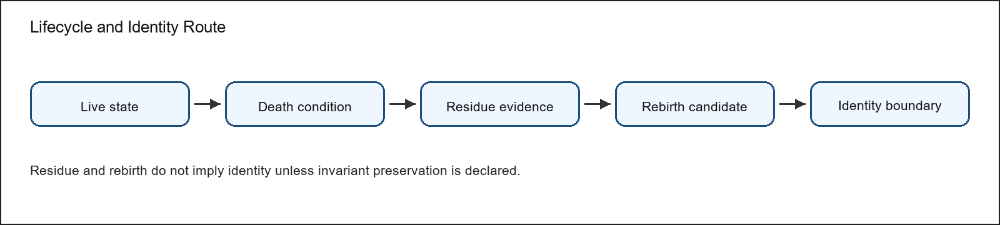
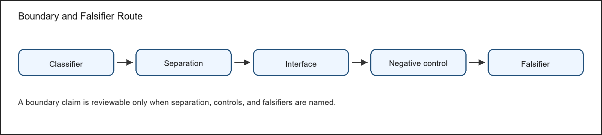
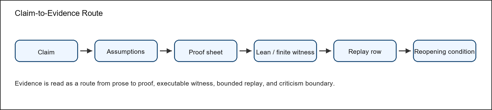
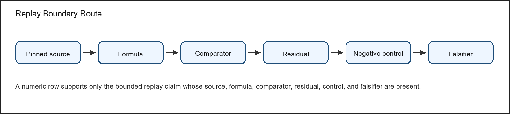

\begin{titlepage}
\thispagestyle{empty}
\centering
\vspace*{0.12\textheight}
{\Huge\bfseries OC Core Journal Core Article v1.3.3\par}
\vspace{1.2em}
{\Large Compact article-style scientific argument\par}
\vspace{2.5em}
{\large Alexander Yashin\par}
{\normalsize Independent Researcher\par}
{\normalsize ORCID 0009-0008-6166-0914\par}
\vfill
{\normalsize Version 1.3.3\par}
{\normalsize Manuscript revision date: 4 May 2026\par}
{\normalsize Concept DOI: 10.5281/zenodo.17899134\par}
\vspace{1.5em}
{\small\itshape Dedicated to my dear wife Maria, without whom this work would have been impossible.\par}
\end{titlepage}
\clearpage

# Acknowledgements {.unnumbered}

The author thanks the reviewers and critics whose questions, objections, and suggestions contributed to the development of the Ontology of Continua and to the refinement of this release. The acknowledged contributors are G. V. Apostolov, Eduard Fadeev, Gennady Alekseevich Nosov, Sergey Shpadyrev, and Stanislav Tsukrov. Their criticism helped sharpen the claim boundaries, improve the reader route, expose weak presentation choices, and force clearer separation between model claims, proof routes, numerical evidence, prior-art comparison, and publication form. Acknowledgement records review pressure and intellectual contribution to the development of the work; it does not imply authorship, endorsement, publication approval, responsibility for the theory, or agreement with any claim promoted in the manuscript.

# Abstract {.unnumbered}

This article version compresses OC Core 1.3.3 into a conventional external-review route. Many contemporary systems are too entangled to be understood by a single domain vocabulary: a technical platform carries physical infrastructure, software architecture, institutional incentives, security boundaries, user cognition, and economic feedback at the same time. The Ontology of Continua addresses that situation as a typed model-core project. It describes continuants, realizations, liveness, death, residue, boundaries, morphisms, operators, cycles, dimension, and K-level witnesses under explicit assumptions, so that a reader can ask how a system persists, changes, fails, and reappears without changing languages at every disciplinary border.

The project is intentionally ambitious in subject matter and intentionally bounded in claim discipline. Its publication task is not to replace physics, biology, cognition, systems engineering, enterprise architecture, or economics with a slogan. Its task is to offer a common structural grammar through which domain experts can compare state spaces, thresholds, flows, cycles, boundaries, and failure conditions without pretending that domain-specific science has become unnecessary.

Version 1.3.3 is a bounded external-review release. It is mature enough to be read as a coherent scientific manuscript and to be checked against formal and executable artifacts, but it remains a staged research program rather than a declaration of final all-domain completion. The release promotes model-core claims where their assumptions and evidence are visible; it leaves broader numerical closure, wider domain validation, and stronger comparative claims as future obligations.

The package contains a full monograph, a compact article route, a methods and reproducibility companion, a reviewer attack-and-response map, release navigation, public evidence anchors, finite-model outputs, Lean subset evidence, bounded target-blind replay QA, comparator and prior-art material, and appendices for proof, figures, tables, numeric rows, and source trace. The monograph is the canonical reading spine; the other documents are curated routes for first reading, editorial review, replay, and hostile criticism.

The evidence status is deliberately mixed and explicit. Some claims are supported by theorem routes, proof sheets, Lean declarations, and finite semantic witnesses. Some claims are supported by bounded numerical or target-blind replay rows that should be read as scoped QA evidence, not as complete empirical validation of a whole domain. Some claims are positioned against prior art or retained as research boundaries because the available evidence is not yet strong enough for a broader statement.

The principal limitation is therefore part of the manuscript's method: public wording must not outrun the evidence. OC Core 1.3.3 asks the reader to evaluate whether the typed model, proof governance, finite semantics, numerical anchors, figures, tables, appendices, and reviewer-response routes form a coherent bounded model-core contribution. Future work must add evidence or mechanization before it widens the public claim surface.

The practical value of the manuscript is therefore a form of disciplined compression. If the model is useful, it should help readers translate complex systems into a shared ontology while preserving the meaningful distinctions that make each domain scientifically serious. That is the standard by which the release asks to be read.

# Version 1.3.3 Release Delta {.unnumbered}

The OC Core release sequence is part of a continuing scientific program rather than a series of isolated archive events. As the model is tested against formal criticism, domain examples, reproducibility checks, and external review, the public manuscript is expected to become more precise, more explicit about its limits, and more useful to readers outside the author's immediate working context.

A new release is therefore warranted only when there is a meaningful scientific or editorial delta: a clarified definition, stronger proof route, better evidence boundary, improved reader pathway, repaired notation, new domain projection, or more honest comparator position. Minor process movement is not enough. The public release should tell readers what changed in the scientific object and why that change matters.

This policy is also a commitment to regularity without pretending that research can be made mechanical. The author intends to make future public updates systematic enough for readers, reviewers, and auditors to follow the development of the model, while preserving the difference between a public scientific result and private working material. No internal route, unpublished process detail, or control-plane record is promoted as reader-facing evidence merely because it helped produce the release.

Version 1.3.3 is the release in which the OC Core corpus is reorganized from a set of scattered source witnesses and process records into a reviewable scientific package. The visible delta is not merely a new archive number: the release strengthens the typed foundation, makes the claim boundary explicit, integrates the theorem route with public proof sheets, and separates reader-facing prose from machine evidence.

The model delta includes clearer treatment of carriers, realizations, liveness, death, residue, rebirth, morphisms, generalized boundaries, hybrid operators, cycle modes, historical and effective dimension, and K-level witnesses. These additions are presented as a bounded model-core grammar rather than as an unrestricted theory of every phenomenon.

The verification delta adds and consolidates a Lean-checked subset, structured proof sheets, finite semantic checks, finite witness interpretation, bounded target-blind replay QA, comparator and prior-art positioning, negative-control and falsifier language, and adversarial-review response material. Where a stronger claim is not yet earned, the release records the limitation instead of hiding it inside a source-control record.

The editorial delta is equally important. Figures, tables, formulas, numeric anchors, appendices, and evidence routes are kept in the publication corpus; machine coverage maps remain coverage and trace data only. The public documents are therefore built from the human manuscript hierarchy and curated payload sources, while source bindings and machine evidence indexes stay in the review manifest.

For a returning reader, the practical point is this: 1.3.3 should be read as a clarification and consolidation release. It does not claim final closure. It improves the public surface through which the model can be criticized, taught, checked, and extended.

# Reader Routes {.unnumbered}

Dear readers, systems theory is of interest to many communities, but rarely in exactly the same way. A formal reviewer, a philosopher of systems, an applied architect, an AI engineer, a security specialist, and an executive reader may all ask legitimate questions of the same manuscript. OC Core 1.3.3 is therefore designed as a deliberately generous scientific reading surface: it aims to disclose the Ontology of Continua as an applied model of system architecture while giving different readers a courteous route into the material.

Scientific reviewers and formal critics may wish to start with the abstract, release delta, model-foundation route, theorem/proof integration route, Lean subset, finite semantic witnesses, proof machinery, and falsifiability sections. This route is meant to make the work attackable in the best sense: every promoted claim should expose its assumptions, proof or executable evidence, counterexample boundary, and reopening condition.

Systems theorists, philosophers, and interested theoretical readers may prefer to start with the continuum problem, the historical and systems-theory motivation, the K-level primer, lifecycle and boundary chapters, prior-art comparison, and limitations. This path asks what OC inherits, what it reorganizes, where its residual delta begins, and where predecessors or parallel branches already carry part of the work.

Applied architects of complex systems--including engineers, enterprise architects, AI builders, security specialists, and applied researchers--may find it useful to start from practical examples, domain projections, figures, tables, and worked routes before returning to the formal core. The model chapters can then be read as a design grammar for carriers, realizations, boundaries, operators, update/flow separation, evidence classes, and claim gates.

CIOs, CEOs, enterprise architects, and strategy readers may sensibly read the release delta, practical utility chapter, model-comparison appendix, and final conclusion before investing in proof details. This route asks what the model is for, what it can support today, what remains too immature for operational commitment, and how evidence classes affect research or enterprise decisions.

Reproducibility auditors, evidence reviewers, and benchmark readers may go directly to the methods and evidence chapters, target-blind replay QA, numeric tables, machine-readable table reference, audit trail, source-trace appendix, and public evidence package manifest. This route asks whether formula, input snapshot, comparator, residual or uncertainty, negative control, falsifier, replay hash, and failure interpretation are present.

The article offers a compact scientific pass, with compressed claims then checked against the monograph and methods companion. In the full package, the conceptual model and formulas live in the monograph's scientific body; the proof route and Lean subset live in theorem, proof, and formalization sections; numeric evidence and target-blind replay QA live in the methods/evidence route; figures and tables live inline in the monograph; appendices carry source trace, proof machinery, comparison rows, audit trail, and machine-readable table references; prior-art comparison and reviewer objections live in the article and attack-response map.

The author asks all readers to treat limitations as part of the claim, not as a footnote. A statement is promoted only where its assumptions, proof or evidence class, comparator boundary, and reopening condition are visible. Claims about complete scientific coverage, unrestricted all-domain numerical closure, or unrestricted superiority over contemporary science are not promoted by this release.

```{=latex}
\clearpage
\renewcommand*\contentsname{Table of Contents}
\setcounter{tocdepth}{2}
\setcounter{secnumdepth}{2}
\makeatletter
% R006_TOC_VISUAL_HIERARCHY
\renewcommand*\l@section[2]{\addvspace{0.5em}\begingroup\bfseries\large\@dottedtocline{1}{0em}{4.8em}{#1}{#2}\endgroup}
\renewcommand*\l@subsection[2]{\@dottedtocline{2}{2.0em}{5.8em}{\small #1}{\small #2}}
\makeatother
\tableofcontents
\clearpage
```

# Reading Map

This reading map is document-specific. The generated PDF table of contents gives page locations; the steps below state what the reader should do with each section.

1. Problem and related work. Read the problem and contribution as a standalone article.
2. Formal object. Locate the formal object and the minimum definitions.
3. Methods and evidence. Read the representative results and evidence table.
4. Results and interpretation. Inspect the embedded figures that operationalize the model.
5. Limitations. Evaluate related-work overlap and residual contribution.
6. Conclusion. Finish with limitations and reviewer-facing consequences.

**Article Structure and Audience.**

Purpose and role. This document is written for journal editors and first-pass peer reviewers. It exists to compress the model-core argument into a conventional article path rather than a register of artifacts, so the opening pages identify the intended reader before they introduce formal claims.

Construction and order. The argument is organized as problem, contribution, formal object, results, evidence, prior art, limits, and conclusion. The article follows a conventional journal sequence: scientific problem, related work, formal object, results, evidence, discussion, limitations, and conclusion.

The teaching obligation is that artifact identifiers appear only after the reader understands the scientific claim they support. The current research support is the bounded OC Core 1.3.3 model-core stack: typed model, theorem and proof route, Lean subset, finite semantic witnesses, bounded replay rows, comparator positioning, phenomenon coverage, negative controls, falsifiers, and adversarial review. For the article, the support stack is compressed into problem, object, result, evidence, discussion, and limitation.

The document therefore states what the reader should learn from the evidence and where that evidence stops. It does not use release-readiness language as a substitute for scientific explanation, and it does not claim unsupported full-science completion.

# Introduction

Cross-domain theories often fail at the point where vocabulary, proof obligation, computational witness, empirical replay, and reviewer boundary stop agreeing with one another. OC Core 1.3.3 asks a bounded question: whether a typed model of continua can state liveness, residue, morphism, boundary, cycle, dimension, and K-level claims in a way that is formal enough for proof review, executable enough for finite semantic checks, and explicit enough for empirical and prior-art criticism.

# Problem

The article problem is not how to rename existing science. The problem is how to keep a cross-domain model honest when it moves from formal definitions to executable witnesses, scoped empirical rows, comparison with prior art, and public release claims. The article therefore treats every strong statement as a claim/evidence pair.

# Contribution

The contribution is not a claim that every scientific domain has been fully computed. The contribution is a model-core release: formal carriers and realizations, theorem/proof boundaries, a Lean-checked subset, finite semantic witnesses, bounded target-blind replay QA examples, comparator positioning, and adversarial-review artifacts arranged for external review.

# Related Work

The article reads OC against systems theory, autopoiesis, dynamical systems, category/type-theory style formalisms, RAF closure, complexity measures, identity theory, and reproducible-research practice. The comparison is not framed as absence of predecessors. It is framed as overlap plus residual delta under declared assumptions.

# Methods

The methods path binds prose claims to proof sheets, Lean declarations, finite semantic cases, bounded numeric replay rows, comparator rows, and explicit reopening conditions. This lets a reviewer reproduce the evidence route without treating the release package as a black box.

# Formal Object

The formal object is a typed continuum carrier with realization, liveness, residue, boundary, morphism, operator, cycle, dimension, and K-level structure. The article does not ask the reader to infer this object from slogans; it points to theorem IDs, proof sheets, Lean declarations, and finite semantic witnesses.

# Definitions Before Evidence IDs

A carrier is the object whose distinctions can be realized. A realization is the way those distinctions become live in a context. Liveness, death, residue, and rebirth describe lifecycle status; they are not interchangeable terms. A boundary is the declared separation or interface condition that makes a claim testable. A morphism records the structure-preserving relation under review. A K-level witness records why an added observable changes the model rather than merely renaming it.

# Main Results

The promoted results are bounded theorem and model-core claims: K0 resolution, lifecycle and status boundaries, hybrid semantics, dimensional and K-level witnesses, and minimality conditions under declared assumptions. Each result is paired with the artifact that can falsify or reopen it.

# Evidence

Evidence appears in four layers: prose proof sheets, Lean subset, executable finite-model cases, and scoped numeric replay rows. The evidence supports the model core and makes weaknesses inspectable; it is not presented as complete scientific coverage.

**Interpretation Before Evidence.**

The release should be evaluated as a bounded model-core artifact. Its strength is that assumptions, witnesses, replay rows, comparator boundaries, and adversarial objections are visible together. Complete scientific coverage and unrestricted comparative claims are outside the promoted article claim surface.

**Related-Work Boundary.**

The comparison accepts overlap with systems theory, autopoiesis, dynamical systems, category/type formalisms, RAF closure, complexity measures, identity theory, and reproducible-research practice. Novelty is stated as residual delta in the combined audit surface, not as absence of predecessors.

**Claim Scope Before Results.**

The release keeps complete scientific completion boundary, final full-science status, and unrestricted modern-science comparison outside the promoted claim surface.

**Argument Roadmap.**

The article path is therefore: define the object, state what is promoted, show how formal claims are supported, show how computational and numeric replay evidence is checked, compare against prior art, and state limits plainly. The full conclusion follows after the results, replay interpretation, prior-art discussion, phenomenon coverage, figures, and literature positioning.

**Visual Route - Article Figures.**

The article uses compact route figures to keep the formal, lifecycle, K-level, boundary, evidence, and replay routes visible while the prose develops the contribution.


Figure 1. The typed-continuum diagram connects the basic object vocabulary to the place where a public claim must be located.



Figure 2. The lifecycle diagram separates liveness, death, residue, rebirth, and identity preservation.


Figure 3. The K-level diagram separates witness-bearing transitions from inert observables that must be demoted.



Figure 4. The boundary diagram links classifier, separation, interface, negative control, and falsifier.



Figure 5. The evidence diagram shows how a statement becomes reviewable instead of remaining a slogan.



Figure 6. The replay-boundary diagram shows why a numeric row is a bounded claim, not a whole-domain proof.

Tuple route. Carrier, realization, liveness, residue, boundary, and morphism prevent the tuple from being treated as a loose metaphor.

Lifecycle route. Live state, death condition, residue evidence, rebirth candidate, and identity boundary prevent residue from being confused with identity continuation.

K-level route. Lower model, added observable, retained witness, reduction test, and lawful demotion prevent hierarchy from being added without a witness.

Evidence route. Claim, assumptions, proof sheet, Lean or finite witness, replay row where applicable, and reopening condition prevent claims from being promoted without support.

Replay route. Source, formula, comparator, residual, negative control, and falsifier prevent numeric evidence from being over-read.

**Route A: Tuple map** Carrier -> realization -> liveness -> residue -> boundary -> morphism. The tuple is read left to right before theorem obligations are inspected.

Review use 1. The route points to the relevant definition, evidence artifact, and reopening condition.

**Route B: Lifecycle route** Live state -> death condition -> residue evidence -> rebirth candidate -> identity boundary. A failed invariant or residue mismatch blocks identity continuation.

Review use 2. The route points to the relevant definition, evidence artifact, and reopening condition.

**Route C: K-level route** Lower model + added observable -> transition witness -> retained distinction test -> demotion when the observable is inert.

Review use 3. The route points to the relevant definition, evidence artifact, and reopening condition.

**Route D: Boundary route** Classifier boundary -> observable separation -> negative control -> falsifier. Metric thresholds are special cases, not the whole boundary theory.

Review use 4. The route points to the relevant definition, evidence artifact, and reopening condition.

**Route E: Evidence route** Claim -> assumptions -> proof sheet -> Lean subset or finite witness -> numeric replay row when applicable -> reviewer reopening condition.

Review use 5. The route points to the relevant definition, evidence artifact, and reopening condition.

**Route F: Replay boundary** Pinned source -> formula -> comparator -> residual -> negative control -> falsifier. A numeric result carries only the claim whose replay boundary is complete.

Review use 6. The route points to the relevant definition, evidence artifact, and reopening condition.

# Results and Evidence Interpretation

The article states results in prose first and uses artifact identifiers as evidence anchors. The promoted surface is bounded: each result has assumptions, a proof or executable witness route, and a condition that would reopen the claim.
Result 1. K0 support is treated as a bounded formal consistency check over declared resolution quotients: same-resolution states are not distinguished, and a finite countermodel shows raw separation need not induce resolution distinction. It is promoted only as a bounded model-core theorem claim, not as an independent novelty or unrestricted theory-wide theorem. The public anchor is K0 resolution theorem. Scope: The claim is limited to the assumptions, witnesses, and falsifier boundary named by its proof and evidence route.

Result 2. Death blocks live status; residue and rebirth are token-bound evidence relations with distinct class-specific endpoint rules: residue separates source from residue while returning to the source endpoint, and rebirth separates source, residue, and new target tokens. Rebirth is non-identity unless endpoint-bound identity evidence has identity class, declared invariant preservation, no residue token, and equal source/target endpoint evidence. No categorical Hom/composition theorem is promoted. The public anchor is lifecycle status theorem. Scope: The claim is limited to the assumptions, witnesses, and falsifier boundary named by its proof and evidence route.

Result 3. Continuumness zero requires live support, an independently clear obstruction register, and a declared zero-cause family; a zero-cause label alone does not compute k=0. The public anchor is K-zero boundary theorem. Scope: The claim is limited to the assumptions, witnesses, and falsifier boundary named by its proof and evidence route.

Result 4. Metric thresholds are a specialization of typed classifier boundaries. The public anchor is boundary representation theorem. Scope: The claim is limited to the assumptions, witnesses, and falsifier boundary named by its proof and evidence route.

Result 5. OC operators are typed update semantics; chart-labelled flow-one notation is admitted only for declared chart records, while proof/rewrite and guard/reset updates remain first-class non-smooth cases. No differentiability or ODE-solution theorem is promoted in current formal profile. The public anchor is hybrid semantics theorem. Scope: The claim is limited to the assumptions, witnesses, and falsifier boundary named by its proof and evidence route.

Result 6. Historical axis activation and effective working rank are kept as distinct bounded formal consistency fields; a finite/Lean witness shows compatibility of monotone historical bookkeeping with decreasing effective rank, but current formal profile does not promote an independent scientific dimension theorem. The public anchor is dimension semantics theorem. Scope: The claim is limited to the assumptions, witnesses, and falsifier boundary named by its proof and evidence route.

The proof route is deliberately plural. Prose proof sheets state assumptions and counterexample boundaries; the Lean subset checks selected formal declarations; finite semantic cases test positive witnesses and negative controls; numeric rows are presented as replay QA or artifact-integrity examples unless a stronger empirical claim is separately evidenced.
Representative theorem anchors are K0 resolution theorem, lifecycle status theorem, K-zero boundary theorem, boundary representation theorem, hybrid semantics theorem, dimension semantics theorem, cycle-mode theorem, and identity and rebirth theorem. The complete theorem register remains in the evidence package for replay.
The bounded numeric evidence touches Physics, Chemistry, Biology, Systems, and Mathematics. These lanes support replay and reconstruction claims, not total domain validation.

# Bounded Empirical Replay Interpretation

The journal article uses the empirical layer as a bounded replay and reconstruction test, not as a claim that every domain has been numerically closed. Each promoted empirical row must have a formula, pinned snapshot, target-blind or held-out target, comparator baseline, uncertainty or residual, negative control, falsifier, and replay hash. The detailed rows belong in the methods companion and public evidence package.
The current replay lanes are Physics, Chemistry, Biology, Systems, and Mathematics. Their scientific function is to show that the model core can be operationalized against pinned data under declared limits; a failed row would reopen the corresponding claim boundary rather than invalidate or validate every possible domain projection.

# Prior-Art Interpretation for Article Readers

The article-level novelty claim is deliberately modest and reviewable. OC does not claim to have invented systems theory, autopoiesis, dynamical systems, category/type formalisms, RAF closure, complexity measures, identity theory, or reproducibility practice. It claims a bounded integration of typed model-core semantics, proof/evidence governance, finite witnesses, replay rows, and public claim boundaries.
The comparator register explicitly touches General System Theory, Autopoiesis, Dynamical Systems, Category and Topos Formalisms, RAF Theory, Complexity and Information Measures, Causal and Identity Theories, Systems Engineering, Hybrid Systems, and Formal Methods and Lean. The article summarizes the overlap/residual-delta pattern and leaves full source rows in the evidence package.

**Source-Linked Related-Work Comparison.**

This article includes the major related-work comparisons directly rather than forcing the reader to open the register first. Each comparison is bounded: overlap is granted, the non-novelty boundary is stated, and the residual contribution is phrased only as positioning unless a stronger source-backed search is available.

**General System Theory.**

Source anchor. Ludwig von Bertalanffy, General System Theory.
Accepted overlap. general systems framing and cross-domain system concepts. The article treats this overlap as real; OC does not claim to invent organized wholes and cross-domain system language.
Non-novelty boundary. If OC is read merely as cross-domain systems language, the novelty claim fails.. This boundary prevents related-work language from becoming an originality slogan.
The residual contribution claimed here is: release-bound typed theorem register plus executable finite witnesses, numeric replay QA, falsifier registry, and authorization-bounded release-governed publication controls. Current boundary: bounded equivalence positioning; no priority claim. The allowed wording is therefore bounded integration or positioning, not priority.

**Autopoiesis.**

Source anchor. Maturana and Varela, Autopoiesis and Cognition.
Accepted overlap. autopoietic organization of living systems. The article treats this overlap as real; OC does not claim to invent self-production and living organization.
Non-novelty boundary. If OC is read as autopoiesis with renamed fields, the novelty claim fails.. This boundary prevents related-work language from becoming an originality slogan.
The residual contribution claimed here is: typed distinction between liveness, death, residue, rebirth, and identity invariants. Current boundary: bounded equivalence positioning; no priority claim. The allowed wording is therefore bounded integration or positioning, not priority.

**Dynamical Systems.**

Source anchor. Encyclopedia of Mathematics, Dynamical system.
Accepted overlap. mathematical dynamical-system state evolution. The article treats this overlap as real; OC does not claim to invent state evolution and flows.
Non-novelty boundary. If OC is read as a dynamical-system formalism only, novelty fails.. This boundary prevents related-work language from becoming an originality slogan.
The residual contribution claimed here is: explicitly blocks differentiating non-smooth proof/rewrite states unless smooth charts are declared. Current boundary: bounded equivalence positioning; no priority claim. The allowed wording is therefore bounded integration or positioning, not priority.

**Category and Topos Formalisms.**

Source anchor. nLab, topos.
Accepted overlap. category/topos formalisms and internal logic. The article treats this overlap as real; OC does not claim to invent typed objects, morphisms, categorical semantics.
Non-novelty boundary. If OC is merely category language over continua, novelty fails.. This boundary prevents related-work language from becoming an originality slogan.
The residual contribution claimed here is: OC uses typed morphism discipline to police public scientific claims while explicitly not claiming invention of category theory. Current boundary: bounded equivalence positioning; no priority claim. The allowed wording is therefore bounded integration or positioning, not priority.

**RAF Theory.**

Source anchor. Hordijk and Steel, Autocatalytic sets and boundaries.
Accepted overlap. RAF formalization of autocatalytic sets and boundary discussion. The article treats this overlap as real; OC does not claim to invent autocatalytic closure and boundaries.
Non-novelty boundary. If OC is read as origin-of-life RAF theory, novelty fails.. This boundary prevents related-work language from becoming an originality slogan.
The residual contribution claimed here is: OC places RAF-like closure as one typed K-level route with explicit reduction and demotion checks while explicitly not replacing RAF theory. Current boundary: bounded equivalence positioning; no priority claim. The allowed wording is therefore bounded integration or positioning, not priority.

**Complexity and Information Measures.**

Source anchor. Stanford Encyclopedia of Philosophy, Information.
Accepted overlap. information concepts and measures. The article treats this overlap as real; OC does not claim to invent information-theoretic and complexity quantities.
Non-novelty boundary. If OC is read as a new complexity measure, novelty fails.. This boundary prevents related-work language from becoming an originality slogan.
The residual contribution claimed here is: separates historical activation from effective rank in the release theorem inventory. Current boundary: bounded equivalence positioning; no priority claim. The allowed wording is therefore bounded integration or positioning, not priority.

**Causal and Identity Theories.**

Source anchor. Stanford Encyclopedia of Philosophy, Identity Over Time.
Accepted overlap. identity-over-time problem space. The article treats this overlap as real; OC does not claim to invent diachronic identity and persistence problems.
Non-novelty boundary. If OC is read as a new metaphysical identity theory, novelty fails.. This boundary prevents related-work language from becoming an originality slogan.
The residual contribution claimed here is: turns identity ambiguity into typed morphism classes with explicit public-claim prohibition. Current boundary: bounded equivalence positioning; no priority claim. The allowed wording is therefore bounded integration or positioning, not priority.

**Systems Engineering.**

Source anchor. INCOSE, Systems Engineering and System Definitions.
Accepted overlap. systems engineering verification and lifecycle concepts. The article treats this overlap as real; OC does not claim to invent verification, validation, lifecycle governance.
Non-novelty boundary. If OC is read as systems engineering with philosophical vocabulary, novelty fails.. This boundary prevents related-work language from becoming an originality slogan.
The residual contribution claimed here is: applies governance machinery to scientific claim promotion and release release-governed locks. Current boundary: bounded equivalence positioning; no priority claim. The allowed wording is therefore bounded integration or positioning, not priority.

The direct comparison above is not a complete history of every field. It is the article-level related-work surface required for external review. The evidence package preserves the fuller comparator rows and source snapshots.

**Phenomenon Coverage Interpretation.**

Phenomenon coverage is treated as a model-card obligation. A phenomenon is not counted as explained merely because it is named; it needs a formal instance, observable, replay or prediction path, comparator, negative control, falsifier, and public claim boundary. Rows that remain illustrative or protocol-ready stay outside promoted explanation claims.

**Worked Article Reading Path.**

A compact article still has to show how the model is used. This section gives a worked reading path without importing the full monograph registers. The goal is to let a first-pass reviewer see how a public claim moves from definition to evidence and then to a reopening condition.

**Worked Path 1: K0 Resolution.**

The K0 result is a useful first test because it is easy to overstate. OC Core 1.3.3 does not say that every absence of visible structure is automatically zero continuumness. It says that a zero-continuumness verdict needs live-support conditions, an obstruction class, and a declared zero-cause family. The proof sheet and finite semantic witness make that distinction executable: changing only a label must not change the verdict, while changing the relevant model facts must change the verdict. That is the article-level scientific point.

**Worked Path 2: Lifecycle Status.**

The lifecycle material separates live realization, death condition, residue, rebirth candidate, and identity continuation. This separation matters because ordinary language tends to slide between survival, trace, copy, and renewal. OC Core 1.3.3 promotes only the bounded claim that the public model can keep those statuses typed and reviewable. A reviewer can attack the exact invariant: if the declared invariant is missing or not preserved, identity continuation is not promoted.

**Worked Path 3: Hybrid Semantics.**

The hybrid result is not a slogan that every system is both continuous and discrete. It states a bounded semantics in which smooth-flow and update/reset aspects have different obligations. Derivative language is available only where the smooth structure supports it; guard and reset language belongs to the executable update side. A reviewer can therefore ask which side carries a claim, and a mismatch reopens the claim rather than being hidden by the word hybrid.

**Worked Path 4: Bounded Replay Row.**

The empirical rows are interpreted as bounded replay and reconstruction rows. The article-level question is whether a row has a formula, pinned input, target rule where applicable, observed value, uncertainty or residual, comparator, negative control, falsifier, and replay hash. When those fields are present, the row supports the named reconstruction claim. It does not become a declaration that the entire field has been solved.

**Worked Path 5: Prior-Art Delta.**

The prior-art question is not whether OC has no predecessors. A serious comparison begins by granting overlap. The residual question is whether the release combines typed continuum semantics, proof governance, executable witnesses, bounded replay rows, comparator discipline, and public claim boundaries in a way that is not already supplied by the same comparator source under the same claim. If the residual delta disappears under same-claim comparison, the novelty wording must shrink.

**Article-Level Evaluation Rule.**

These worked paths define the article's burden. The reader should not have to trust a file name, a package status, or a general assertion of rigor. The reader should see the claim, the evidence class, the attack surface, and the condition that would reopen the claim. That is why the article is shorter than the monograph but stricter than a promotional abstract: it is a gateway into the full scientific package.

**Prior-Art and Literature Position.**

The bibliography is not decorative. It locates OC against emergence, phase transitions, autopoiesis, dynamical systems, RAF chemistry, information/complexity, identity over time, hybrid systems, formal methods, systems engineering, and reproducibility practice. Therefore the release uses literature to bound novelty rather than to claim absence of all prior work.
The working bibliography contains 60 entries and the comparator register carries 14 source anchors. The public text does not use those counts as evidence by themselves; it uses them to force a synthesis question for each family: what is inherited, what is rephrased, what is genuinely residual, and what cannot be claimed yet.

**Synthesis Families.**

- **General systems and emergence:** OC inherits the systems-theory concern with organization across levels, but makes the release claim auditable by binding each promoted model-core claim to proof, finite semantic witness, or replay artifact.
- **Autopoiesis and organizational closure:** OC treats liveness and residue as typed state predicates rather than as metaphor; this allows death, persistence, and rebirth boundaries to be attacked precisely.
- **Dynamical and hybrid systems:** OC does not replace dynamical systems theory; it adds a typed release surface for smooth/update laws, guard/reset semantics, and claims about what a hybrid witness preserves.
- **Formal ontology and foundational ontology:** OC uses ontology language only inside a declared model-core vocabulary. It does not claim to replace formal-ontology programs such as BFO or general ontology-engineering practice; the residual claim is the release-governed combination of continuum status, liveness, residue, K-level witnesses, and evidence promotion.
- **Mereology, mereotopology, and boundaries:** OC accepts that parts, wholes, spatial boundaries, fiat boundaries, and bona-fide boundaries have extensive prior-art traditions. The 1.3.3 contribution is not priority over those traditions; it is the typed classifier-boundary route used to keep public claims reviewable.
- **Process ontology and continuity traditions:** OC inherits the need to distinguish process, persistence, transition, and continuity. It contributes only the bounded typed lifecycle and release-evidence discipline used here, not a universal settlement of process metaphysics.
- **Category and type-theoretic formalisms:** OC uses typed carriers and morphism classes as a reviewable formal vocabulary while keeping stronger categorical equivalence claims outside the promoted surface unless separately proved.
- **RAF and chemical closure:** OC uses closure-like intuitions only where the domain lane supplies a pinned replay or a stated protocol boundary; chemistry is not used as a rhetorical proof for all domains.
- **Complexity and information measures:** OC positions complexity claims as bounded hypotheses with falsifiers, not as a unrestricted growth law promoted by this release.
- **Identity, continuity, and lifecycle theory:** OC's identity/rebirth language is tied to declared invariant preservation and residue relations, which makes the scope of identity claims explicit.
- **Reproducible research and artifact evaluation:** OC treats the release package itself as a scientific object: claims, proof sheets, Lean subset, finite cases, numeric rows, and public metadata must remain traceable and replayable.

**Selected Bibliography.**

- **P. W. Anderson, 1972:** More is Different. Science.
- **Dietrich Stauffer and Ammon Aharony, 1994:** Introduction to Percolation Theory. Taylor & Francis.
- **Geoffrey Grimmett, 1999:** Percolation. Springer.
- **Nigel Goldenfeld, 1992:** Lectures on Phase Transitions and the Renormalization Group. Westview Press.
- **Leo P. Kadanoff, 1966:** Scaling Laws for Ising Models Near T_c. Physics.
- **Kenneth G. Wilson, 1975:** The Renormalization Group and Critical Phenomena. Reviews of Modern Physics.
- **L. D. Landau and E. M. Lifshitz, 1980:** Statistical Physics, Part 1. Butterworth-Heinemann.
- **Ilya Prigogine, 1980:** From Being to Becoming: Time and Complexity in the Physical Sciences. W. H. Freeman.
- **Hermann Haken, 1983:** Synergetics: An Introduction. Springer.
- **Gregoire Nicolis and Ilya Prigogine, 1977:** Self-Organization in Nonequilibrium Systems. Wiley.
- **Stuart A. Kauffman, 1993:** The Origins of Order: Self-Organization and Selection in Evolution. Oxford University Press.
- **Wim Hordijk and Mike Steel, 2017:** Autocatalytic Sets and the Origin of Life. Entropy.
- **Per Bak, Chao Tang and Kurt Wiesenfeld, 1987:** Self-Organized Criticality: An Explanation of 1/f Noise. Physical Review Letters.
- **M. E. J. Newman, 2010:** Networks: An Introduction. Oxford University Press.
- **Albert-Laszlo Barabasi and Reka Albert, 1999:** Emergence of Scaling in Random Networks. Science.
- **Robert M. May, 1972:** Will a Large Complex System be Stable?. Nature.
- **Alan M. Turing, 1952:** The Chemical Basis of Morphogenesis. Philosophical Transactions of the Royal Society B.
- **John J. Hopfield, 1982:** Neural Networks and Physical Systems with Emergent Collective Computational Abilities. Proceedings of the National Academy of Sciences.
- **Donald O. Hebb, 1949:** The Organization of Behavior. Wiley.
- **Karl Friston, 2010:** The Free-Energy Principle: A Unified Brain Theory?. Nature Reviews Neuroscience.
- **Claude E. Shannon, 1948:** A Mathematical Theory of Communication. Bell System Technical Journal.
- **E. T. Jaynes, 2003:** Probability Theory: The Logic of Science. Cambridge University Press.
- **Thomas M. Cover and Joy A. Thomas, 1991:** Elements of Information Theory. Wiley.
- **Mark Granovetter, 1978:** Threshold Models of Collective Behavior. American Journal of Sociology.
- **Thomas C. Schelling, 1978:** Micromotives and Macrobehavior. W. W. Norton.
- **Robert B. Laughlin, 2005:** A Different Universe: Reinventing Physics from the Bottom Down. Basic Books.
- **Stephen Wolfram, 2002:** A New Kind of Science. Wolfram Media.
- **Ludwig von Bertalanffy, 1968:** General System Theory: Foundations, Development, Applications. George Braziller.
- **Kenneth E. Boulding, 1956:** General Systems Theory: The Skeleton of Science. Management Science.
- **James Grier Miller, 1978:** Living Systems. McGraw-Hill.
- **Mihajlo D. Mesarovic and Yasuhiko Takahara, 1975:** General Systems Theory: Mathematical Foundations. Academic Press.
- **George J. Klir, 1985:** Architecture of Systems Problem Solving. Plenum Press.
- **Humberto R. Maturana and Francisco J. Varela, 1980:** Autopoiesis and Cognition: The Realization of the Living. D. Reidel.
- **Francisco J. Varela, 1979:** Principles of Biological Autonomy. North Holland.
- **Murray Gell-Mann and Seth Lloyd, 1996:** Information Measures, Effective Complexity, and Total Information. Complexity.
- **William Bialek and Ilya Nemenman and Naftali Tishby, 2001:** Predictability, Complexity, and Learning. Neural Computation.
- **Giulio Tononi, 2004:** An Information Integration Theory of Consciousness. BMC Neuroscience.
- **Marten Scheffer, 2009:** Critical Transitions in Nature and Society. Princeton University Press.
- **Vasilis Dakos and Marten Scheffer and Egbert H. van Nes and Victor Brovkin and Vladimir Petoukhov and Hermann Held, 2008:** Slowing Down as an Early Warning Signal for Abrupt Climate Change. Proceedings of the National Academy of Sciences.
- **Derek Parfit, 1984:** Reasons and Persons. Oxford University Press.
- **William C. Wimsatt, 1972:** Complexity and Organization. PSA: Proceedings of the Biennial Meeting of the Philosophy of Science Association.
- **Peter J. Olver, 1993:** Applications of Lie Groups to Differential Equations. Springer.
Additional machine-readable citation metadata is available in the evidence package; this public section uses the selected set to explain the comparator landscape rather than to present a raw bibliography dump.

**Comparator Argument.**

The relevant comparator question is not whether OC invented systems language, autopoiesis, dynamical systems, category theory, RAF closure, information theory, identity theory, hybrid systems, formal verification, or research-object packaging. It did not. The bounded 1.3.3 novelty claim is narrower: OC uses typed carriers, liveness, residue, morphism classes, K-level witnesses, proof registers, executable finite checks, bounded numeric replay rows, and release-governed claim promotion as one auditable model-core package. Each comparator row therefore records accepted overlap first and residual delta second.
The detailed source-anchor table remains in the evidence package. The public text uses the synthesis families above because scholarly positioning must be argued by comparison, not by displaying a list of URLs or dates.

**Figure Route Summary.**

The article embeds the minimum figure route directly: tuple, lifecycle, K-level, boundary, evidence, and replay-boundary diagrams appear in the article itself. The master monograph contains the larger figure sequence, but the article does not require that sequence to understand the core visual logic.

# Discussion

The article-level contribution is a bounded model-core release, not a claim that every scientific domain has been completed. Its scientific value is the alignment of a typed continuum object, theorem/proof boundaries, Lean and finite semantic evidence, scoped replay rows, prior-art positioning, and explicit reopening conditions. The discussion therefore asks whether those layers cohere as a reviewable public object.

The formal layer comes first because empirical or computational evidence can only be interpreted after the object of interpretation is declared. Terms such as carrier, realization, liveness, residue, boundary, morphism, operator, cycle, dimension, and K-level witness are not decorative vocabulary; they decide what a proof sheet, finite case, or replay row can support.

The empirical layer is intentionally bounded. The release contains replay and reconstruction rows with formulas, pinned inputs, comparators, residuals, negative controls, falsifiers, and hashes. Those rows demonstrate auditability and scoped operationalization; they do not assert complete validation of physics, chemistry, biology, systems science, mathematics, or every future domain projection.

The prior-art layer is overlap-first. OC intersects with systems theory, autopoiesis, dynamical systems, type and category-oriented formalisms, RAF closure, complexity measures, identity theory, hybrid systems, and reproducible-research practice. The release's defensible novelty is the combined typed model-core plus evidence-governed public claim surface, not a denial that those traditions already contain major parts of the problem space.

# Limitations

The release does not promote final full-science completion, unrestricted numeric closure, or unrestricted victory over every modern scientific model. It also does not treat a successful replay row as proof of an entire domain. A failed proof dependency, finite witness, comparator, negative control, falsifier, or replay hash reopens the specific claim that depends on it.

Legacy theorem material is retained as part of the full corpus and must be read through the current claim boundary. A legacy result is promoted only when the current 1.3.3 proof and evidence surfaces support the promoted wording. Otherwise it remains background, motivation, or a research-program obligation.

# Conclusion

OC Core 1.3.3 is publication-relevant as a bounded external-review model-core release: it gives reviewers a typed object, stated theorem obligations, executable witness routes, scoped replay evidence, prior-art boundaries, and adversarial reopening rules in one public package. The stronger full-science ambitions remain valuable, but they require later evidence before becoming promoted public claims.

\clearpage
\section*{Keywords and Citation Route}

Keywords: Ontology of Continua; continuum ontology; typed model core; systems theory; autopoiesis; dynamical systems; hybrid systems; formal methods; Lean formalization; finite semantic checks; target-blind replay QA; reproducible research; artifact evaluation; claim governance; falsifiability; evidence-bound scientific publishing.

Citation identity: Alexander Yashin, OC Core Journal Core Article v1.3.3, 4 May 2026. The Concept DOI is printed on the title page.

Open repository: <https://github.com/alexanderyashin/ontology-of-continua-core-main>. Repository files support reproducibility and source inspection; they do not replace the manuscript's claim boundaries.
